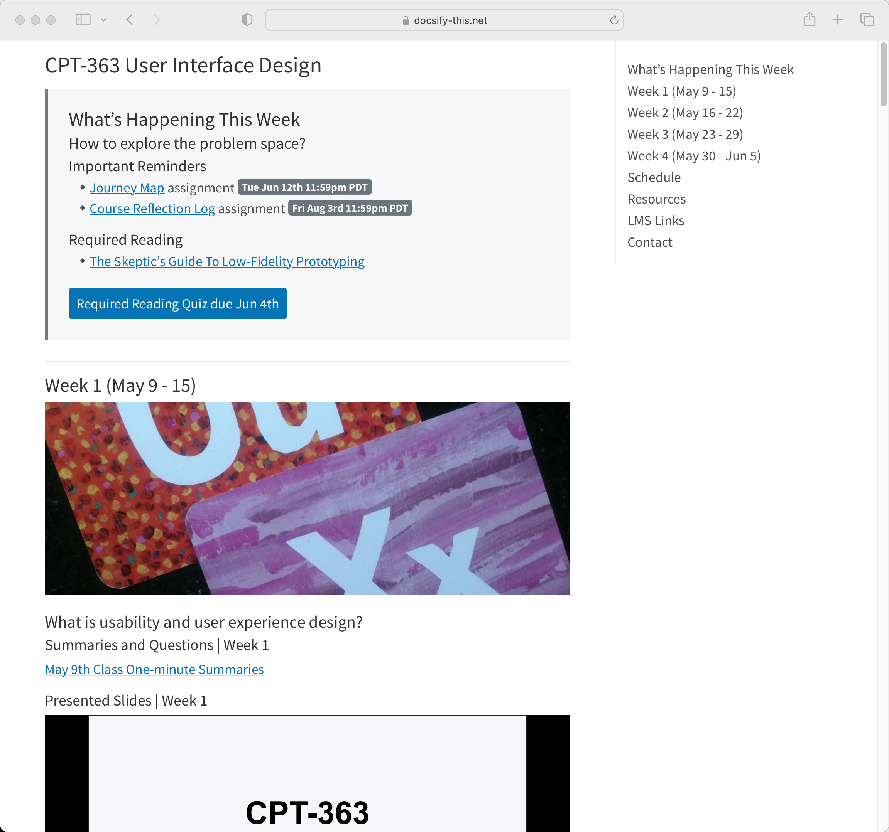

# Docsify-This One Page Course Template

> This is a one page course template for use with [Docsify-This.net](https://docsify-this.net/#/).

_Figure 1. Docsify Docsify-This One Page Course Template. Explore the resulting standalone web page generated by Docsify-This.net at [https://docsify-this.net/?basePath=https://raw.githubusercontent.com/hibbitts-design/docsify-this-one-page-course/main&homepage=home.md&toc=true&edit-link=https://github.com/hibbitts-design/docsify-this-one-page-course/blob/main/home.md](https://docsify-this.net/?basePath=https://raw.githubusercontent.com/hibbitts-design/docsify-this-one-page-course/main&homepage=home.md&toc=true&edit-link=https://github.com/hibbitts-design/docsify-this-one-page-course/blob/main/home.md)_

How to Use
---

1. Tap **Use this template** in this repository (upper-right green button) and then choose **Create a new repository**

2. Choose the name for your new repository to contain the files and then tap **Create repository**

3. View the **home.md** Markdown file in your newly created repository and copy it's URL

4. Go to https://docsify-this.net and paste the copied URL into the **Markdown File URL** field

5. Select the page options you want (e.g. Table of Contents) and tap the **View as Standalone Page** button to view your Markdown file as a web page for sharing or embedding

You can further customize the appearance of your web page by tapping on the **Show More Page Options »** link in the Docsfy-This Web Page Builder.

Docsify-This Examples
---

[Docsify-This One Page Course Template](https://github.com/hibbitts-design/docsify-this-one-page-course/blob/main/home.md), displayed by Docsify-This as a:  
* [Standalone Page](https://docsify-this.net/?basePath=https://raw.githubusercontent.com/hibbitts-design/docsify-this-one-page-course/main&homepage=home.md "Docsify-This One Page Course")  
* [Standalone Page with Table of Contents](https://docsify-this.net/?basePath=https://raw.githubusercontent.com/hibbitts-design/docsify-this-one-page-course/main&homepage=home.md&toc=true "Docsify-This One Page Course")
* [Standalone Page with Docsify Sidebar](https://docsify-this.net/?basePath=https://raw.githubusercontent.com/hibbitts-design/docsify-this-one-page-course/main&homepage=home.md&sidebar=true "Docsify-This One Page Course")
